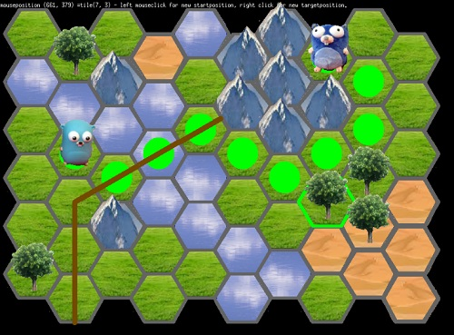

# ebitengine-hexboard

a simple example for a hexboard with ebitengine.    
the example draws two floors and you can flip the tiles x and y.    
the hex-pathfinding works (see green path over the bridge).    

ebitengine: https://ebitengine.org/    
good information for hex: https://www.redblobgames.com/grids/hexagons/    

screenshot:    


# new changes:     
- mousecoordinates and corresponding hextile
- selected hextile greenlighted
- first sprites
- recognition of mouseclicked sprite
- added astar pathfinding for hexboard ... program seems to turn into a jungle...maybe i should put the pathfinding later to other file/library?...
  from the test in init:        
    ```
    astar := NewAStar(ngrid)
    var path *Stack[*ANode]
     path=astar.FindPath(Vector2{4,0}, Vector2{5,3})
     fmt.Println("pathlen: ", path.Count())
     for i := 0; i < path.Count(); i++ {
		fmt.Println("path Nr:", i, " x:", path.items[i].Position.X, " y:", path.items[i].Position.Y)
     }
    ```
- changed layout to oddq. now hexcoordinates are correct and hexpathfinding works (see green path over the bridge)!! only pixeltohex still not perfect...
  
  
    
  
